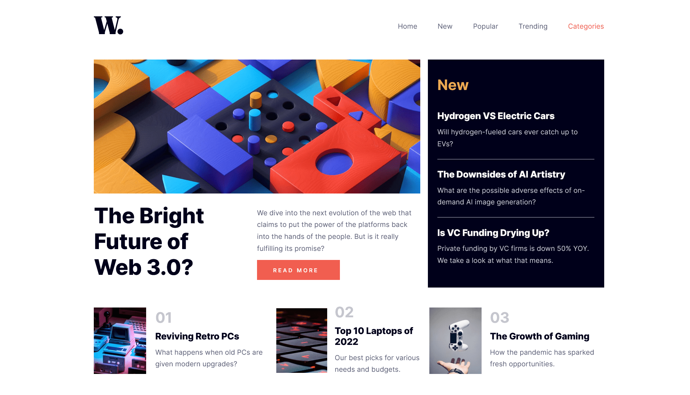

# Frontend Mentor - News homepage solution

This is a solution to the [News homepage challenge on Frontend Mentor](https://www.frontendmentor.io/challenges/news-homepage-H6SWTa1MFl). Frontend Mentor challenges help you improve your coding skills by building realistic projects. 

## Table of contents

- [Overview](#overview)
  - [The challenge](#the-challenge)
  - [Screenshot](#screenshot)
  - [Links](#links)
  - [Built with](#built-with)
  - [Author](#author)

## Overview

### The challenge

Users should be able to:

- View the optimal layout for the interface depending on their device's screen size
- See hover and focus states for all interactive elements on the page
- **Bonus**: Toggle the mobile menu (requires some JavaScript)

### Screenshot

### Links
- Solution URL: [News Homepage Main ↗](https://www.frontendmentor.io/solutions/news-homepage-main-html-css-js-1pUjYtu2xf)
- Live Site URL: [Link ↗](https://itsdevdeepak.github.io/news-homepage-main/)

### Built with

- Semantic HTML5 markup
- CSS custom properties
- Flexbox
- Mobile-first workflow

### Author

- Twitter - [@itsdevdeepak ↗](https://www.twitter.com/itsdevdeepak)
- Frontend Mentor - [@itsdevdeepak ↗](https://www.frontendmentor.io/profile/itsdevdeepak)